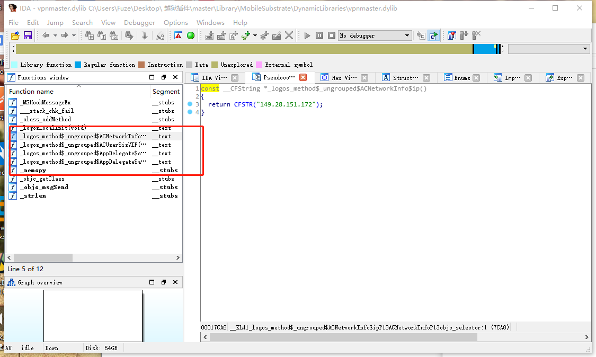

# iOS越狱之hook别人的库
之前我分享过分析别人的APP，找到对应的逻辑进行修改
今天我给大家分享，分析别人已经分析好的动态库，二次hook，站在别人的肩膀上
本次使用到的工具有越狱手机，cydown, ida
下载一个我们常使用的vpn插件，这里使用了`top.margua.vpnmastergjb_1.0_iphoneos-arm.deb`
首先对该包进行解包
`
    dpkg -x top.margua.vpnmastergjb_1.0_iphoneos-arm.deb master
`
获得文件夹master，里面是多级目录，找到最后一层`DynamicLibraries`
这里我们就看到了两个文件`vpnmaster.dylib`和`vpnmaster.plist`
`vpnmaster.dylib`是别人做好的动态库，`vpnmaster.plist`里面主要是对哪个APP做了hook

可以看到，分别是 ACNetworkInfo中的ip方法，这个让自己变成一个国外用户的IP

`
    const __CFString *_logos_method$_ungrouped$ACNetworkInfo$ip() 
    { 
    return CFSTR("149.28.151.172"); 
    }
`

这个ACUser的isVIP，让APP认为自己是VIP
`
    signed __int64 _logos_method$_ungrouped$ACUser$isVIP() { return 1LL; }
`

APPdelegate中的UIAlertView点击方法

`
    
    void *__fastcall _logos_method$_ungrouped$AppDelegate$alertView$clickedButtonAtIndex$(__int64 a1, __int64 a2, void *a3, __int64 a4)
    {
      void *v4; // x0
      void *result; // x0
      void *v6; // ST10_8
      void *v7; // x0
    
      v4 = objc_msgSend(a3, "buttonTitleAtIndex:", a4);
      result = objc_msgSend(v4, "isEqualToString:", CFSTR("进入官网"));
      if ( (unsigned __int8)result & 1 )
      {
        v6 = objc_msgSend(&OBJC_CLASS___UIApplication, "sharedApplication");
        v7 = objc_msgSend(
               &OBJC_CLASS___NSURL,
               "URLWithString:",
               CFSTR("https://%72%65%70%6F%2E%63%79%64%69%61%62%63%2E%74%6F%70/"));
        result = objc_msgSend(v6, "openURL:", v7);
      }
      return result;
    }
`

APPdelegate新增UIAlertView弹窗
`

        __int64 __fastcall              _logos_method$_ungrouped$AppDelegate$application$didFinishLaunchingWithOptions  $(__int64 a1, __int64 a2, __int64 a3, __int64 a4)
    {
      void *v4; // x0
      __int64 v6; // [xsp+0h] [xbp-40h]
      void *v7; // [xsp+8h] [xbp-38h]
      char v8; // [xsp+17h] [xbp-29h]
      void *v9; // [xsp+18h] [xbp-28h]
      __int64 v10; // [xsp+20h] [xbp-20h]
      __int64 v11; // [xsp+28h] [xbp-18h]
      __int64 v12; // [xsp+30h] [xbp-10h]
      __int64 v13; // [xsp+38h] [xbp-8h]
    
      v13 = a1;
      v12 = a2;
      v11 = a3;
      v10 = a4;
      v9 = objc_msgSend(&OBJC_CLASS___NSUserDefaults, "standardUserDefaults");
      v8 = (unsigned __int64)objc_msgSend(v9, "boolForKey:", CFSTR("xiaopingguo")) & 1;
      if ( !v8 )
      {
        v4 = objc_msgSend(&OBJC_CLASS___UIAlertView, "alloc");
        v6 = 0LL;
        v7 = objc_msgSend(
               v4,
               "initWithTitle:message:delegate:cancelButtonTitle:otherButtonTitles:",
               CFSTR("\x3D\xD8\x18\xDEVpn Master高级版\x3D\xD8\x18\xDE"),
               CFSTR("本插件为免费插件，严禁贩卖出售\nä»…ä¾›äº¤æµå­¦ä¹ ï¼Œå¥½ç”¨è¯·è€ƒè™‘æåŠ©ä½œè€…"),
               v13,
               CFSTR("进入应用"),
               CFSTR("进入官网"),
               0LL);
        objc_msgSend(v7, "show");
        objc_msgSend(v7, "release");
        objc_msgSend(v9, "setBool:forKey:", 1LL, CFSTR("xiaopingguo"));
      }
      return _logos_orig$_ungrouped$AppDelegate$application$didFinishLaunchingWithOptions$(v13, v12, v11, v10) & 1;
    }

`

一切就绪，可以在这样的基础上对APP进行二次开发了

